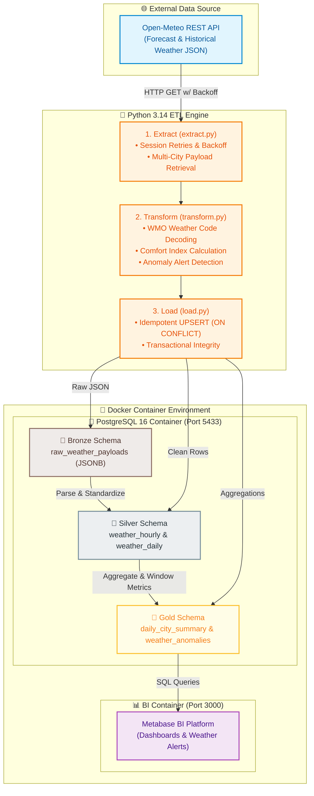

# Open-Meteo REST API → PostgreSQL Medallion ETL Pipeline

[](https://www.python.org/)
[](https://www.postgresql.org/)
[](https://www.docker.com/)
[](https://www.metabase.com/)
[](LICENSE)

A production-style Data Engineering pipeline that ingests historical and forecast weather metrics from the [Open-Meteo REST API](https://open-meteo.com/), processes them through a **Medallion Data Architecture (Bronze → Silver → Gold)** in PostgreSQL, and serves analytics-ready datasets to an interactive Metabase dashboard.

---

## Architecture Overview



---

## Key Design Patterns & Engineering Touches

### 1. Medallion Architecture (Bronze → Silver → Gold)
* **Bronze (`bronze.raw_weather_payloads`)**: Ingests immutable raw API responses directly as `JSONB` alongside metadata (`batch_id` UUID, request timestamp, HTTP status code, API URL).
* **Silver (`silver.weather_hourly`, `silver.weather_daily`)**: Parses JSON arrays into typed tabular schemas. Standardizes temperatures to Celsius, converts wind speeds to km/h, and translates WMO numerical weather codes into human-readable descriptions (e.g. `63` → `"Moderate rain"`).
* **Gold (`gold.daily_city_summary`, `gold.weather_anomalies`)**: Generates business aggregations including 7-day rolling average temperatures via window functions, comfort indices, and automatically flags severe weather anomalies (Heatwaves `≥35°C`, Freezing `≤0°C`, Heavy Rain `≥20mm`, High Winds `≥45 km/h`).

### 2. HTTP Resilience & Exponential Backoff
Uses `urllib3.util.Retry` configured on a custom `requests.Session` with a `backoff_factor=1.5` handling rate limits (`429`) and transient server errors (`500`, `502`, `503`, `504`).

### 3. Idempotent Ingestion
All database insertions into Silver and Gold layers utilize PostgreSQL `ON CONFLICT DO UPDATE` (UPSERT) logic keyed on natural composite keys (`city`, `timestamp` / `city`, `date`). Running the pipeline multiple times will never generate duplicate rows.

### 4. Configuration & Secrets Management
All credentials and runtime settings are loaded dynamically from environment variables using `python-dotenv`. Credentials and API settings are never hardcoded.

---

## Directory Structure

```text
open_meteo_etl/
├── .env.example             # Template for DB credentials & target configuration
├── .gitignore               # Excludes secrets, venv, logs, and build artifacts
├── docker-compose.yml       # Container specs for PostgreSQL 16 & Metabase
├── requirements.txt         # Python dependencies
├── run_pipeline.py          # CLI entrypoint (--run-once, --schedule, --verify)
├── init_db/
│   └── 01_init_schema.sql   # DDL script creating bronze, silver, and gold schemas
├── etl/
│   ├── __init__.py
│   ├── config.py            # Environment configuration & logger initialization
│   ├── db.py                # Database connection pool & context manager
│   ├── extract.py           # REST API client with HTTP retry strategy
│   ├── transform.py         # Medallion data transformation logic
│   ├── load.py              # Idempotent database loader (UPSERTS)
│   └── pipeline.py          # Pipeline orchestration workflow
└── logs/
    └── etl.log              # Rotating log output
```

---

## Quickstart Guide

### Prerequisites
* [Docker Desktop](https://www.docker.com/products/docker-desktop/) (v20.10+)
* [Python 3.10+](https://www.python.org/)

### 1. Environment Configuration
Clone the repository and copy the `.env.example` file:
```bash
git clone https://github.com/callbyIshant/Weather-ETL-Pipeline.git
cd Weather-ETL-Pipeline
cp .env.example .env
```

### 2. Spin Up Infrastructure
Start PostgreSQL and Metabase containers:
```bash
docker compose up -d
```
* **PostgreSQL**: Bound to `localhost:5433` (DB: `weather_db`, User: `weather_user`)
* **Metabase**: Available at `http://localhost:3000`

### 3. Setup Python Virtual Environment & Run Pipeline
```bash
# Create and activate virtual environment
python -m venv .venv
source .venv/bin/activate  # On Windows: .venv\Scripts\activate

# Install dependencies
pip install -r requirements.txt

# Run pipeline once (includes automated layer verification output)
python run_pipeline.py --run-once
```

### 4. Pipeline Execution Options

```bash
# Run pipeline on a recurring schedule (e.g. every 60 minutes)
python run_pipeline.py --schedule 60

# Inspect existing database row counts across Medallion schemas
python run_pipeline.py --verify
```

## License

This project is licensed under the MIT License - see the [LICENSE](LICENSE) file for details.
